<a href="https://aguilarb.tech">
<picture>
<source media="(prefers-color-scheme: dark)" srcset="assets/banner-mac-green-dark.v12.svg">
<source media="(prefers-color-scheme: light)" srcset="assets/banner-mac-green-light.v12.svg">

</picture>
</a>
 

 

## Hola, soy Benjamin 👋

**Software Developer · AI Product Builder · Estudiante de Ingeniería Informática 🇨🇱**

Construyo soluciones para problemas reales de negocio: desarrollo backend, ERP/CRM en producción, integraciones, cloud e inteligencia artificial.

Trabajo con **Odoo, Python y FastAPI**, desarrollando y manteniendo sistemas empresariales, APIs e integraciones con plataformas de facturación electrónica y el **SII de Chile**. Esta experiencia incluye entender requerimientos, resolver incidentes, trabajar con datos y mantener servicios utilizados en operaciones diarias.

Integro IA en mi flujo de ingeniería con **ChatGPT, Claude y Conductor** para arquitectura, análisis de código, automatización, documentación y prototipado. La uso como complemento del conocimiento técnico y la comprensión del software.

Actualmente profundizo en **arquitectura y seguridad AWS, Cloud & DevOps, Docker y Kubernetes**. Me interesan el desarrollo seguro, la seguridad de aplicaciones y **DevSecOps**. Fuera del trabajo y la universidad, construyo productos y convierto lo que aprendo en soluciones útiles.

**Build. Learn. Deploy. Repeat.**

## Stack y herramientas

| Área | Tecnologías y prácticas |
| --- | --- |
| Backend | Python · FastAPI · Node.js · REST APIs |
| ERP / CRM e integraciones | Odoo · PostgreSQL · XML · ERP/CRM · Facturación electrónica · Integraciones SII |
| Frontend | React · Next.js · TypeScript · JavaScript · HTML · CSS · Tailwind CSS |
| Datos y plataformas | PostgreSQL · SQL · Supabase · Vercel |
| Cloud y DevOps | AWS · Docker · Linux · Git · GitHub · CI/CD · Infraestructura como código |
| IA y automatización | OpenAI · LLM · Agentes · RAG · Tool Calling · Prompt Engineering · WhatsApp API |
| Desarrollo asistido por IA | ChatGPT · Claude · Conductor · Cursor · VS Code |
| Seguridad | Ciberseguridad · DevSecOps · Seguridad de aplicaciones · Redes · Fundamentos de ethical hacking |
| En formación | AWS Cloud Architecture · Cloud Security · Kubernetes |
