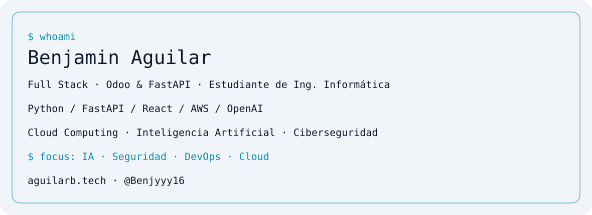

<picture>
<source media="(prefers-color-scheme: dark)" srcset="assets/banner-dark.svg">

</picture>

## Hola, soy Benjamin 👋

Desarrollador Full Stack y estudiante de **Ingeniería Informática**. Especializado en **Odoo y FastAPI**, con experiencia en despliegues AWS, Docker e integración de modelos OpenAI.
Mis pilares: **Cloud Computing · Inteligencia Artificial · Ciberseguridad**.

[🌐 Portafolio](https://aguilarb.tech) · [GitHub](https://github.com/Benjyyy16)

## Stack

| Área | Tecnologías |
| --- | --- |
| Backend / ERP | Python · FastAPI · Odoo · Node.js · PostgreSQL |
| Frontend | React · Next.js · TypeScript |
| Cloud / DevOps | AWS · Docker · Linux · Git |
| IA | OpenAI · Agentes · RAG · Tool Calling · Prompt Engineering |

## Proyectos destacados

| Proyecto | Enfoque |
| --- | --- |
| [Baodoo](https://baodoo.cl) | Desarrollo principal e integración de módulos Odoo |
| [Datgent](https://hackatondatgent.vercel.app) | Agentes especializados; hackathon Código Facilito |
| [UBO HUB Connect](https://ubohub-connect.vercel.app) | Colaboración académica y proyectos reales |
| [Regatea](https://regatea.vercel.app) | Interacción y gestión de ofertas |
| Benjyy · privado | Soporte automatizado en WhatsApp |
| Automatización de Correos · privado | Clasificación y respuestas con IA |
| Optimización Energética COPEC · privado | Automatización y monitoreo energético |

## Logros

- **1.er lugar:** Rally Latinoamericano de Innovación.
- **4.º lugar:** Hackathon CarWorkChile; IA para formación de conductores.

Detalles y otros proyectos en [mi portafolio](https://aguilarb.tech).

## Más proyectos

- **Voltito:** arquitectura de producto para optimización energética.
- **Odoo API Monitor:** monitoreo de APIs, métricas, alertas e integraciones resilientes.
- **Conector Odoo ↔ Bsale:** sincronización de procesos empresariales con trazabilidad.

## Certificaciones y formación

Ver 13 credenciales y logros

| Credential | Issuer | Issued |
|---|---|---|
| AWS Academy Graduate — Cloud Foundations | Amazon Web Services | Jul 2026 |
| Software Development with AI Agents and Kiro Bootcamp | Código Facilito | Jul 2026 |
| Cisco Networking Academy Learn-A-Thon 2026 | Cisco | Jul 2026 |
| Networking Basics | Cisco | Jun 2026 |
| Python Essentials 1 | Cisco | Jun 2026 |
| Practical Artificial Intelligence Immersion | Daxus Latam | May 2026 |
| AWS Academy Graduate — Generative AI Foundations | Amazon Web Services | Apr 2026 |
| Introduction to Modern AI | Cisco | Mar 2026 |
| 1st Place — Latin American Innovation Rally | Rally Latinoamericano de Innovación | Oct 2025 |
| Introduction to Front-End Development | Meta | Jul 2025 |
| Development and Innovation | Universidad Central de Chile | May 2025 |
| Introduction to Cybersecurity | Cisco | May 2025 |
| Introduction to Cybersecurity | IBM | Dec 2024 |

Credential IDs: Meta `UN8MY7Q6DCD6` · IBM `H0MGX1KUC5RN`

[Ver credenciales en LinkedIn](https://www.linkedin.com/in/benjamin-aguilar-b-847846347/)

